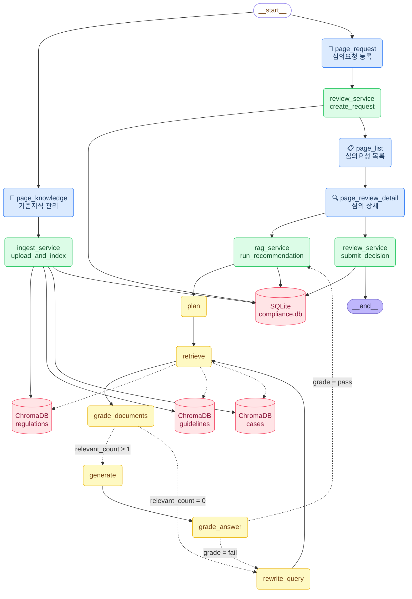
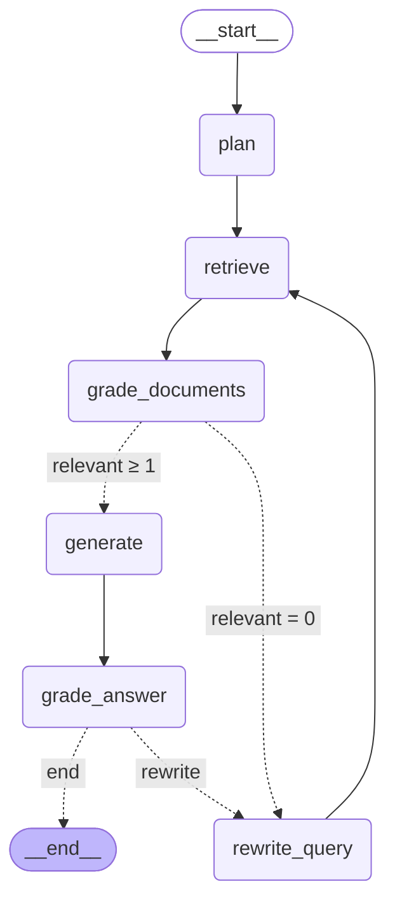

# BroadcastComplianceAgent — 전체 시스템 흐름도

```mermaid
graph TD
    __start__([<p>__start__</p>]):::first

    %% ── UI Pages ──
    page_knowledge(<p>📄 page_knowledge<br/>기준지식 관리</p>):::ui
    page_request(<p>📝 page_request<br/>심의요청 등록</p>):::ui
    page_list(<p>📋 page_list<br/>심의요청 목록</p>):::ui
    page_review_detail(<p>🔍 page_review_detail<br/>심의 상세</p>):::ui

    %% ── Services ──
    ingest_service(<p>ingest_service<br/>upload_and_index</p>):::service
    review_service(<p>review_service<br/>create_request</p>):::service
    rag_service(<p>rag_service<br/>run_recommendation</p>):::service
    decision_service(<p>review_service<br/>submit_decision</p>):::service

    %% ── LangGraph Nodes ──
    plan(plan):::node
    retrieve(retrieve):::node
    grade_documents(grade_documents):::node
    rewrite_query(rewrite_query):::node
    generate(generate):::node
    grade_answer(grade_answer):::node

    %% ── Storage ──
    sqlite[(<p>SQLite<br/>compliance.db</p>)]:::storage
    chroma_regulations[(<p>ChromaDB<br/>regulations</p>)]:::storage
    chroma_guidelines[(<p>ChromaDB<br/>guidelines</p>)]:::storage
    chroma_cases[(<p>ChromaDB<br/>cases</p>)]:::storage

    __end__([<p>__end__</p>]):::last

    %% ── Edges ──
    __start__ --> page_knowledge
    __start__ --> page_request

    page_knowledge --> ingest_service
    ingest_service --> chroma_regulations
    ingest_service --> chroma_guidelines
    ingest_service --> chroma_cases
    ingest_service --> sqlite

    page_request --> review_service
    review_service --> sqlite
    review_service --> page_list

    page_list --> page_review_detail
    page_review_detail --> rag_service

    rag_service --> plan
    plan --> retrieve
    retrieve --> grade_documents
    grade_documents -.->|relevant_count ≥ 1| generate
    grade_documents -.->|relevant_count = 0| rewrite_query
    rewrite_query --> retrieve
    generate --> grade_answer
    grade_answer -.->|grade = pass| rag_service
    grade_answer -.->|grade = fail| rewrite_query

    retrieve -.-> chroma_regulations
    retrieve -.-> chroma_guidelines
    retrieve -.-> chroma_cases

    rag_service --> sqlite
    page_review_detail --> decision_service
    decision_service --> sqlite
    decision_service --> __end__

    classDef default fill:#f2f0ff,stroke:#9d8ff0,color:#1a1a2e,line-height:1.2
    classDef first fill-opacity:0,stroke:#9d8ff0
    classDef last fill:#bfb6fc,stroke:#7c6fcd,color:#1a1a2e
    classDef ui fill:#dbeafe,stroke:#3b82f6,color:#1e3a5f
    classDef service fill:#dcfce7,stroke:#22c55e,color:#14532d
    classDef node fill:#fef9c3,stroke:#eab308,color:#713f12
    classDef storage fill:#ffe4e6,stroke:#f43f5e,color:#881337
```

---

## ReviewChain 내부 — LangGraph 노드 상세

```mermaid
graph TD
    __start__([<p>__start__</p>]):::first

    plan(plan)
    retrieve(retrieve)
    grade_documents(grade_documents)
    rewrite_query(rewrite_query)
    generate(generate)
    grade_answer(grade_answer)

    __end__([<p>__end__</p>]):::last

    __start__ --> plan
    plan --> retrieve
    retrieve --> grade_documents
    grade_documents -. &nbsp;relevant ≥ 1&nbsp; .-> generate
    grade_documents -. &nbsp;relevant = 0&nbsp; .-> rewrite_query
    rewrite_query --> retrieve
    generate --> grade_answer
    grade_answer -. &nbsp;end&nbsp; .-> __end__
    grade_answer -. &nbsp;rewrite&nbsp; .-> rewrite_query

    classDef default fill:#f2f0ff,line-height:1.2
    classDef first fill-opacity:0
    classDef last fill:#bfb6fc
```
